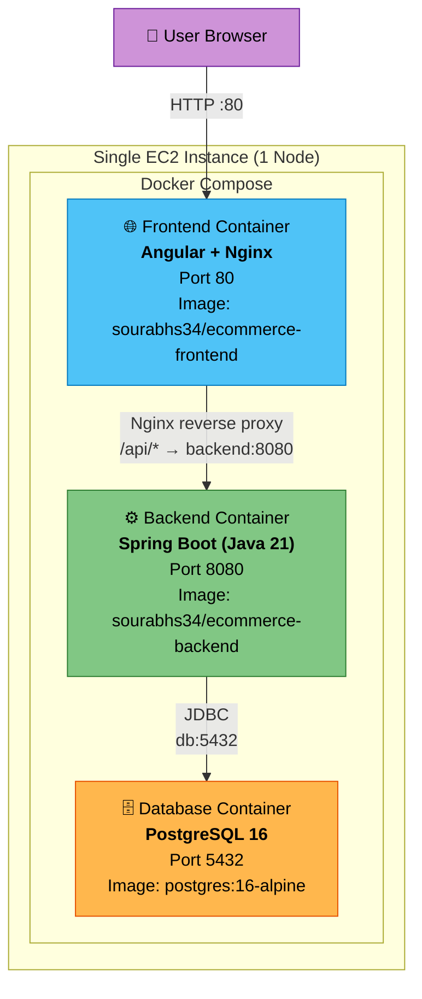
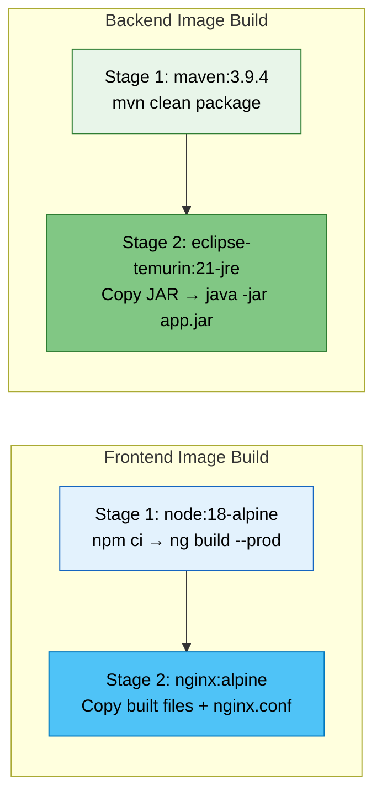
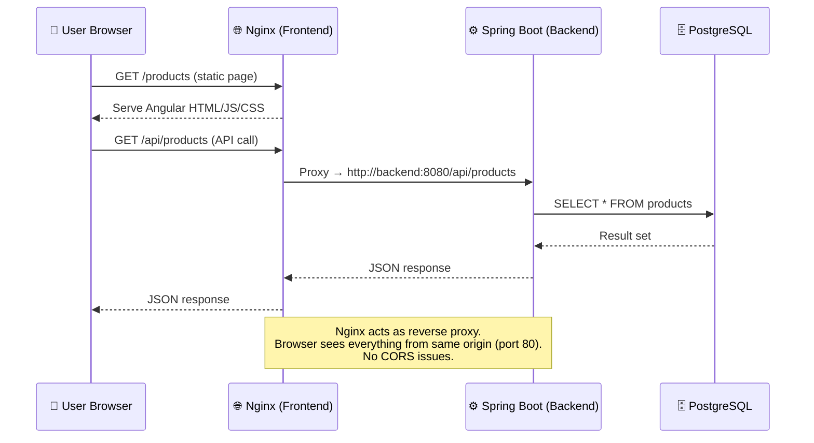
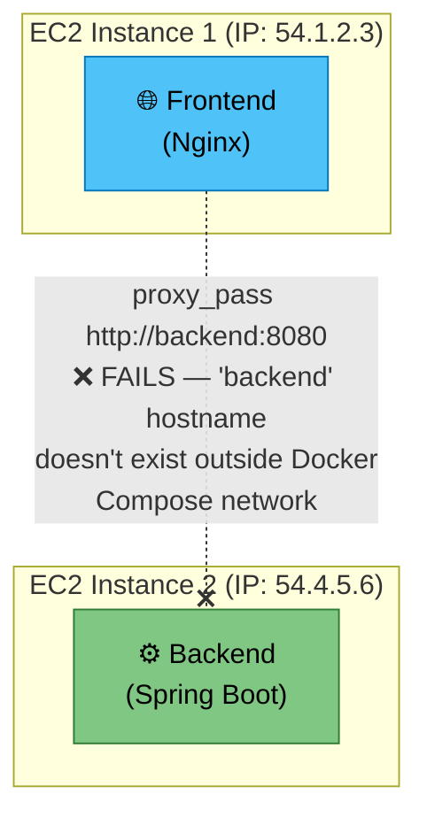
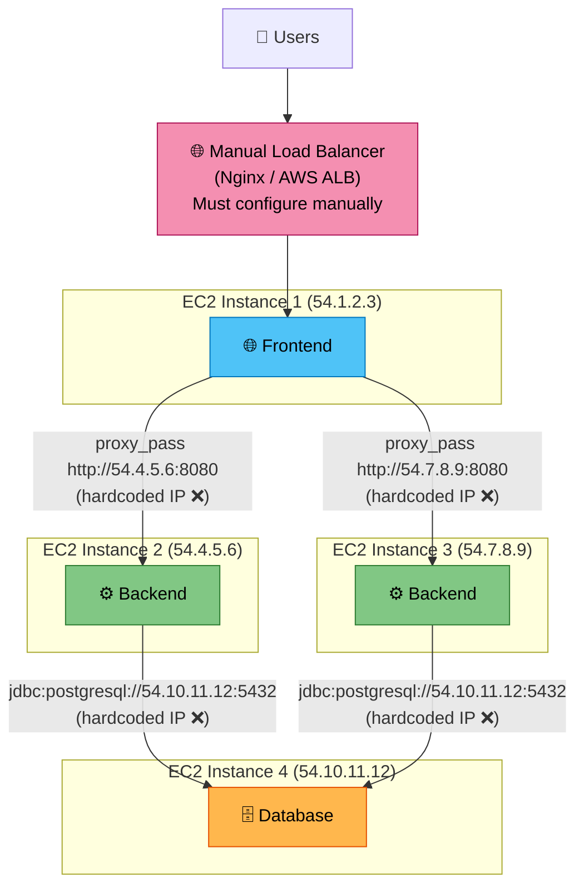
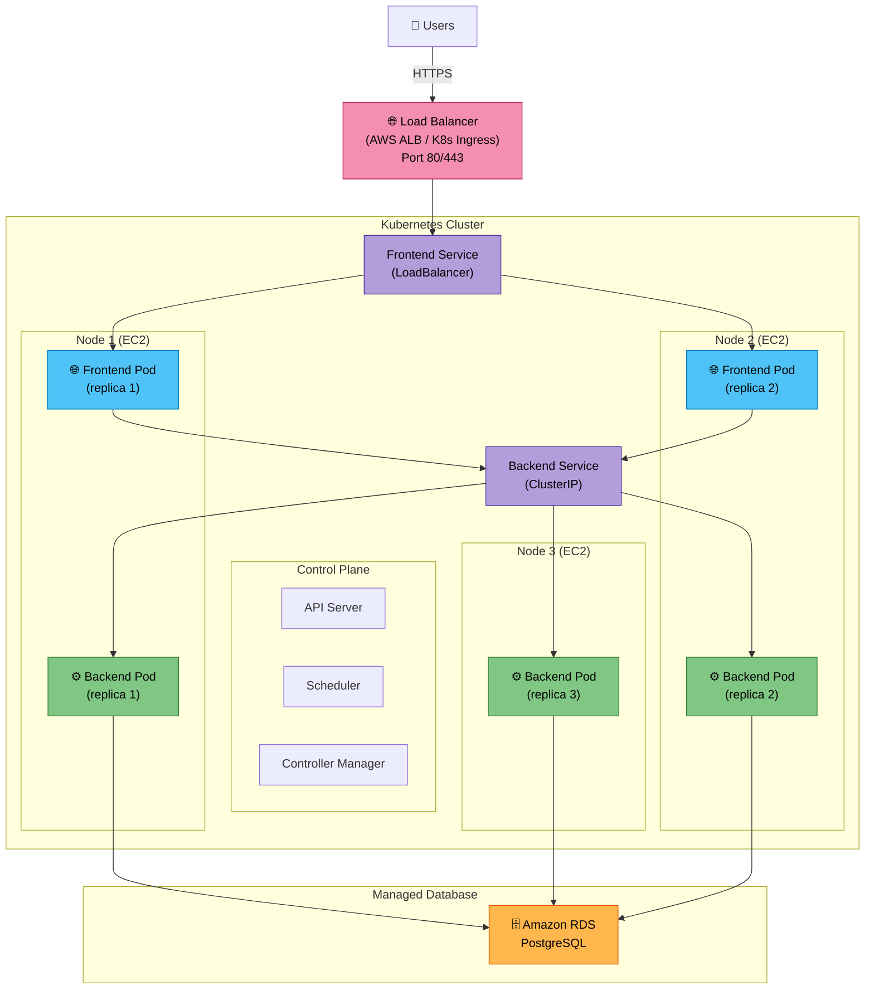
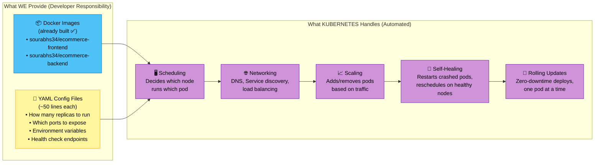

# Application — Architecture & Scaling Plan

> **Author:** Sourabh Garg  
> **Date:** April 21, 2026  
> **Status:** Current Architecture + Proposed Kubernetes Migration

---

## 1. Current Architecture (Docker Compose)

We run **2 custom Docker images** and **1 database image** — all on a **single EC2 instance** (1 node).



### Container Summary

| Container | Image | Technology | Port | Purpose |
|-----------|-------|-----------|------|---------|
| `ecommerce-frontend` | `sourabhs34/ecommerce-frontend:latest` | Angular 17 + Nginx | 80 | Serves UI & reverse proxies API calls |
| `ecommerce-backend` | `sourabhs34/ecommerce-backend:latest` | Spring Boot 3 + Java 21 | 8080 | REST API, business logic, authentication |
| `ecommerce-db` | `postgres:16-alpine` | PostgreSQL 16 | 5432 | Persistent data storage |

### Docker Images — Build Process

Both custom images use **multi-stage builds** for optimized image size:



---

## 2. How Frontend & Backend Communicate (Current)

The Angular app runs in the **user's browser** and makes API calls to `/api/*`. Nginx intercepts these and **reverse proxies** them to the backend container.



### Key Design Decision: Nginx Reverse Proxy

```nginx
# nginx.conf (inside frontend container)
location /api/ {
    proxy_pass http://backend:8080;
}
```

- **Why?** The browser sees only one origin (`http://your-domain:80`), eliminating CORS issues.
- **How does `backend` hostname resolve?** Docker Compose creates a shared network — containers discover each other by **service name**.

---

## 3. Limitations of Current Setup

| Risk | Impact | Severity |
|------|--------|----------|
| **Single point of failure** | If the EC2 instance goes down, the entire application is unavailable | 🔴 High |
| **No horizontal scaling** | Cannot distribute load across multiple machines | 🔴 High |
| **Manual deployments** | Downtime during every redeploy | 🟡 Medium |
| **No auto-healing** | Crashed containers need manual intervention (beyond restart policy) | 🟡 Medium |
| **Resource ceiling** | Limited by the single machine's CPU/RAM | 🟡 Medium |

---

## 4. Can We Scale to Multiple Nodes WITHOUT Kubernetes?

Before jumping to Kubernetes, it's important to understand what happens if we try to run our application on **multiple machines without an orchestrator**.

### The Problem: Nodes Can't Discover Each Other



**Why it fails:** Docker Compose creates a **local virtual network** on a single machine. The hostname `backend` is only resolvable within that network. If we move the backend to a separate EC2 instance, the frontend container has **no way to find it** by name.

### Manual Workaround (Without Kubernetes)

We would have to **hardcode IP addresses** and manually set up everything:



**Problems with this approach:**
- If any EC2 instance gets a **new IP** (e.g., after restart), we must **manually update** nginx.conf and redeploy
- We need to **manually configure** the load balancer to know about each backend
- If a backend instance **crashes**, nobody auto-detects or auto-restarts it
- **Adding a new backend** means updating nginx configs on every frontend manually

### What We'd Have to Do Manually (Without K8s)

| Task | Without Kubernetes | With Kubernetes |
|------|-------------------|----------------|
| **Service Discovery** | Hardcode IP addresses in nginx.conf — breaks if IP changes | Automatic DNS: `backend` resolves anywhere in cluster |
| **Load Balancing** | Set up and configure Nginx/HAProxy manually on a separate machine | Built-in: Service distributes traffic automatically |
| **Scaling** | SSH into each machine, pull image, run container manually | One command: `kubectl scale --replicas=5` |
| **Health Checks** | Write custom scripts to monitor and restart containers | Built-in: liveness/readiness probes |
| **Failover** | Manually detect failure, manually start container on another machine | Automatic: pod rescheduled on healthy node in seconds |
| **Rolling Updates** | Stop old container → deploy new → downtime during transition | Automatic: updates one pod at a time, zero downtime |
| **Config Changes** | SSH into each machine, update nginx.conf, restart | Update YAML, `kubectl apply` — rolls out everywhere |

> **Bottom Line:** Without Kubernetes, scaling to multiple nodes requires a LOT of manual infrastructure work — hardcoded IPs, custom scripts, manual monitoring. This is exactly the problem Kubernetes was built to solve.

---

## 5. Proposed Architecture (Kubernetes)

Kubernetes distributes our containers (**pods**) across **multiple nodes** (EC2 instances), providing high availability, auto-scaling, and self-healing.



### What We Provide vs What Kubernetes Handles

The migration to Kubernetes **does not require any application code changes**. Our existing Docker images work as-is. We only need to provide two things:



| Responsibility | Owner | Details |
|---------------|-------|---------|
| **Docker Images** | ✅ Already done | `sourabhs34/ecommerce-frontend:latest` and `sourabhs34/ecommerce-backend:latest` are on Docker Hub |
| **YAML Manifest Files** | Developer (one-time) | Simple configuration files that tell Kubernetes *how* to run our images (replicas, ports, env vars, secrets) |
| **Scheduling** | Kubernetes | Automatically decides which node (machine) to place each pod on, based on available resources |
| **Networking & DNS** | Kubernetes | Creates internal DNS so pods find each other by name (e.g., `backend:8080`) — same as Docker Compose |
| **Load Balancing** | Kubernetes | Distributes traffic evenly across all healthy replicas of a service |
| **Auto-Scaling** | Kubernetes | Monitors CPU/memory and adds or removes pod replicas automatically |
| **Self-Healing** | Kubernetes | Detects crashed pods and restarts them; reschedules pods if an entire node goes down |
| **Rolling Updates** | Kubernetes | Deploys new image versions one pod at a time with zero downtime |

> **Key Takeaway:** We provide the **Docker images** (the *what*) and **YAML config files** (the *how*). Kubernetes handles **everything else** — scheduling, networking, scaling, healing, and deployments — fully automated.

### Example YAML Config (Backend Deployment)

This is the only new file we need to write for the backend — Kubernetes uses it to know what to run:

```yaml
apiVersion: apps/v1
kind: Deployment
metadata:
  name: ecommerce-backend
spec:
  replicas: 3                                        # Run 3 copies
  selector:
    matchLabels:
      app: ecommerce-backend
  template:
    metadata:
      labels:
        app: ecommerce-backend                       # Must match selector above
    spec:
      containers:
        - name: backend
          image: sourabhs34/ecommerce-backend:latest  # Our existing image
          ports:
            - containerPort: 8080
          env:
            - name: DB_URL
              value: jdbc:postgresql://ecommerce-db:5432/ecommerce
```

> **No application code changes.** No Dockerfile changes. Just this YAML file, and Kubernetes runs 3 copies of our backend across multiple machines, load-balanced and self-healing.

---

*Document prepared for management review.*