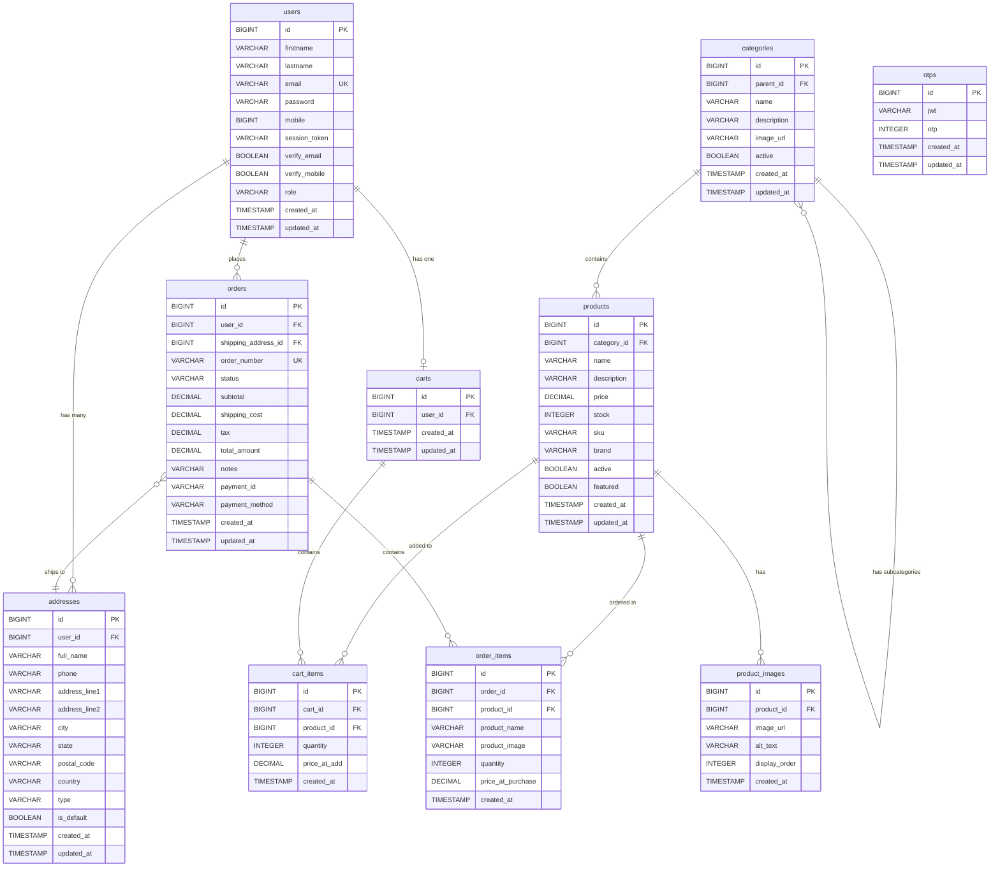

# 🗄️ ECommerce Database Design

> **Database:** PostgreSQL | **ORM:** Hibernate/JPA | **DDL Strategy:** `update` (auto-schema)

---

## Entity Relationship Diagram



---

## Table Definitions

### 1. `users`

The central entity. Stores account credentials, verification flags, and session tokens.

| Column | Type | Constraints | Notes |
|--------|------|-------------|-------|
| `id` | `BIGINT` | PK, Auto-increment | — |
| `firstname` | `VARCHAR(255)` | — | — |
| `lastname` | `VARCHAR(255)` | — | — |
| `email` | `VARCHAR(255)` | **UNIQUE, NOT NULL** | Login identifier |
| `password` | `VARCHAR(255)` | — | BCrypt hashed |
| `mobile` | `BIGINT` | — | — |
| `session_token` | `VARCHAR(1000)` | — | Active JWT stored for single-device session |
| `verify_email` | `BOOLEAN` | Default `false` | OTP-verified flag |
| `verify_mobile` | `BOOLEAN` | Default `false` | OTP-verified flag |
| `role` | `VARCHAR(255)` | Default `ROLE_USER` | Spring Security role |
| `created_at` | `TIMESTAMP` | NOT NULL, immutable | `@CreatedDate` |
| `updated_at` | `TIMESTAMP` | — | `@LastModifiedDate` |

---

### 2. `addresses`

User shipping/billing addresses. Multiple addresses per user, one can be marked as default.

| Column | Type | Constraints | Notes |
|--------|------|-------------|-------|
| `id` | `BIGINT` | PK, Auto-increment | — |
| `user_id` | `BIGINT` | **FK → users.id**, NOT NULL | Owner |
| `full_name` | `VARCHAR(255)` | NOT NULL | Recipient name |
| `phone` | `VARCHAR(255)` | NOT NULL | — |
| `address_line1` | `VARCHAR(255)` | NOT NULL | — |
| `address_line2` | `VARCHAR(255)` | — | Optional |
| `city` | `VARCHAR(255)` | NOT NULL | — |
| `state` | `VARCHAR(255)` | NOT NULL | — |
| `postal_code` | `VARCHAR(255)` | NOT NULL | — |
| `country` | `VARCHAR(255)` | NOT NULL, Default `India` | — |
| `type` | `VARCHAR(255)` | Default `HOME` | Enum: `HOME, WORK, OTHER, SHIPPING, BILLING` |
| `is_default` | `BOOLEAN` | Default `false` | — |
| `created_at` | `TIMESTAMP` | NOT NULL, immutable | — |
| `updated_at` | `TIMESTAMP` | — | — |

---

### 3. `categories`

Supports **hierarchical nesting** via self-referential `parent_id` foreign key.

| Column | Type | Constraints | Notes |
|--------|------|-------------|-------|
| `id` | `BIGINT` | PK, Auto-increment | — |
| `parent_id` | `BIGINT` | FK → categories.id | NULL = root category |
| `name` | `VARCHAR(255)` | NOT NULL | — |
| `description` | `VARCHAR(255)` | — | — |
| `image_url` | `VARCHAR(255)` | — | Category thumbnail |
| `active` | `BOOLEAN` | Default `true` | Soft-delete flag |
| `created_at` | `TIMESTAMP` | NOT NULL, immutable | — |
| `updated_at` | `TIMESTAMP` | — | — |

---

### 4. `products`

Core product catalog. Linked to a category and owns multiple images.

| Column | Type | Constraints | Notes |
|--------|------|-------------|-------|
| `id` | `BIGINT` | PK, Auto-increment | — |
| `category_id` | `BIGINT` | FK → categories.id | — |
| `name` | `VARCHAR(255)` | NOT NULL | — |
| `description` | `VARCHAR(2000)` | — | Extended text |
| `price` | `DECIMAL(10,2)` | NOT NULL | — |
| `stock` | `INTEGER` | NOT NULL, Default `0` | Inventory count |
| `sku` | `VARCHAR(255)` | — | Stock Keeping Unit |
| `brand` | `VARCHAR(255)` | — | — |
| `active` | `BOOLEAN` | Default `true` | Listing visibility |
| `featured` | `BOOLEAN` | Default `false` | Homepage showcase |
| `created_at` | `TIMESTAMP` | NOT NULL, immutable | — |
| `updated_at` | `TIMESTAMP` | — | — |

---

### 5. `product_images`

Multiple images per product, ordered by `display_order`. Cascade-deleted with parent product (`orphanRemoval = true`).

| Column | Type | Constraints | Notes |
|--------|------|-------------|-------|
| `id` | `BIGINT` | PK, Auto-increment | — |
| `product_id` | `BIGINT` | **FK → products.id**, NOT NULL | Owner product |
| `image_url` | `VARCHAR(255)` | NOT NULL | — |
| `alt_text` | `VARCHAR(255)` | — | Accessibility |
| `display_order` | `INTEGER` | Default `0` | Sort order (`ORDER BY ASC`) |
| `created_at` | `TIMESTAMP` | NOT NULL, immutable | — |

---

### 6. `carts`

**One-to-One** with User. Each user has at most one active cart.

| Column | Type | Constraints | Notes |
|--------|------|-------------|-------|
| `id` | `BIGINT` | PK, Auto-increment | — |
| `user_id` | `BIGINT` | **FK → users.id**, NOT NULL, **UNIQUE** | One cart per user |
| `created_at` | `TIMESTAMP` | NOT NULL, immutable | — |
| `updated_at` | `TIMESTAMP` | — | — |

---

### 7. `cart_items`

Line items in a cart. Cascade-deleted when cart is cleared (`orphanRemoval = true`).

| Column | Type | Constraints | Notes |
|--------|------|-------------|-------|
| `id` | `BIGINT` | PK, Auto-increment | — |
| `cart_id` | `BIGINT` | **FK → carts.id**, NOT NULL | Parent cart |
| `product_id` | `BIGINT` | **FK → products.id**, NOT NULL | — |
| `quantity` | `INTEGER` | NOT NULL, Default `1` | — |
| `price_at_add` | `DECIMAL(10,2)` | — | Snapshot of price when added |
| `created_at` | `TIMESTAMP` | NOT NULL, immutable | — |

---

### 8. `orders`

Represents a placed order. Linked to user and a shipping address. `order_number` is auto-generated UUID-based (`ORD-XXXXXXXX`).

| Column | Type | Constraints | Notes |
|--------|------|-------------|-------|
| `id` | `BIGINT` | PK, Auto-increment | — |
| `user_id` | `BIGINT` | **FK → users.id**, NOT NULL | Buyer |
| `shipping_address_id` | `BIGINT` | **FK → addresses.id**, NOT NULL | Delivery destination |
| `order_number` | `VARCHAR(255)` | **UNIQUE**, NOT NULL | `ORD-` + UUID prefix |
| `status` | `VARCHAR(255)` | NOT NULL, Default `PENDING` | See [Order Status Enum](#order-status-enum) |
| `subtotal` | `DECIMAL(10,2)` | NOT NULL | Sum of item totals |
| `shipping_cost` | `DECIMAL(10,2)` | Default `0.00` | — |
| `tax` | `DECIMAL(10,2)` | Default `0.00` | — |
| `total_amount` | `DECIMAL(10,2)` | NOT NULL | `subtotal + shipping + tax` |
| `notes` | `VARCHAR(255)` | — | Customer notes |
| `payment_id` | `VARCHAR(255)` | — | External payment gateway ID |
| `payment_method` | `VARCHAR(255)` | — | e.g. `UPI`, `CARD`, `COD` |
| `created_at` | `TIMESTAMP` | NOT NULL, immutable | — |
| `updated_at` | `TIMESTAMP` | — | — |

---

### 9. `order_items`

Snapshots product details at purchase time so data remains valid even if the product is later modified/deleted.

| Column | Type | Constraints | Notes |
|--------|------|-------------|-------|
| `id` | `BIGINT` | PK, Auto-increment | — |
| `order_id` | `BIGINT` | **FK → orders.id**, NOT NULL | Parent order |
| `product_id` | `BIGINT` | FK → products.id | Nullable (product may be deleted) |
| `product_name` | `VARCHAR(255)` | NOT NULL | **Snapshot** of name at purchase |
| `product_image` | `VARCHAR(255)` | — | **Snapshot** of image at purchase |
| `quantity` | `INTEGER` | NOT NULL | — |
| `price_at_purchase` | `DECIMAL(10,2)` | NOT NULL | **Snapshot** of unit price |
| `created_at` | `TIMESTAMP` | NOT NULL, immutable | — |

---

### 10. `otps`

Stores OTP codes (for email/mobile verification). Cleaned up periodically by `OtpCleanupScheduler`.

| Column | Type | Constraints | Notes |
|--------|------|-------------|-------|
| `id` | `BIGINT` | PK, Auto-increment | — |
| `jwt` | `VARCHAR(255)` | — | JWT token tied to OTP session |
| `otp` | `INTEGER` | — | Numeric one-time password |
| `created_at` | `TIMESTAMP` | NOT NULL, immutable | — |
| `updated_at` | `TIMESTAMP` | — | — |

---

## Order Status Enum

```
PENDING → CONFIRMED → PROCESSING → SHIPPED → DELIVERED
                                          ↘ CANCELLED
                                          ↘ REFUNDED
```

| Status | Meaning |
|--------|---------|
| `PENDING` | Order placed, awaiting payment/confirmation |
| `CONFIRMED` | Payment confirmed |
| `PROCESSING` | Being prepared for shipment |
| `SHIPPED` | Shipped to customer |
| `DELIVERED` | Successfully delivered |
| `CANCELLED` | Cancelled by user or system |
| `REFUNDED` | Payment refunded |

---

## Relationship Summary

| Relationship | Type | Cascade | Notes |
|---|---|---|---|
| User → Addresses | One-to-Many | — | User owns multiple addresses |
| User → Cart | One-to-One | — | `user_id` is UNIQUE on carts |
| User → Orders | One-to-Many | — | User places multiple orders |
| Category → Subcategories | Self-referential One-to-Many | `ALL` | Hierarchical tree |
| Category → Products | One-to-Many | `ALL` | Products belong to a category |
| Product → ProductImages | One-to-Many | `ALL` + orphanRemoval | Images deleted with product |
| Cart → CartItems | One-to-Many | `ALL` + orphanRemoval | Items cleared with cart |
| Order → OrderItems | One-to-Many | `ALL` + orphanRemoval | Items tied to order lifecycle |
| Order → Address | Many-to-One | — | Ships to a saved address |
| CartItem → Product | Many-to-One | — | References current product |
| OrderItem → Product | Many-to-One | — | Nullable (product may be deleted) |

---

## Key Design Decisions

1. **Price Snapshots** — `CartItem.priceAtAdd` and `OrderItem.priceAtPurchase` capture the price at that moment, protecting against future price changes.

2. **Product Snapshots in Orders** — `OrderItem` stores `productName` and `productImage` directly, so order history remains accurate even if the product is modified or deleted.

3. **Self-referential Categories** — `parent_id` on `categories` enables unlimited nesting depth for category hierarchies (e.g., Electronics → Phones → Smartphones).

4. **Soft Deletes** — Products and Categories use `active` boolean flags rather than hard deletes, preserving referential integrity with existing orders.

5. **UUID-based Order Numbers** — `ORD-XXXXXXXX` format using `@PrePersist` for collision-safe, human-readable order identifiers.

6. **Automatic Auditing** — All entities use `@EntityListeners(AuditingEntityListener.class)` with `@CreatedDate` / `@LastModifiedDate` for automatic timestamp management.

7. **Session Token on User** — Single active session design by storing the current JWT in `sessionToken` (max 1000 chars).
